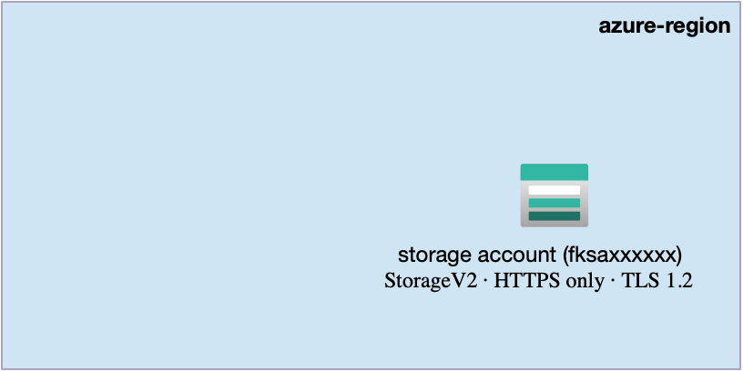
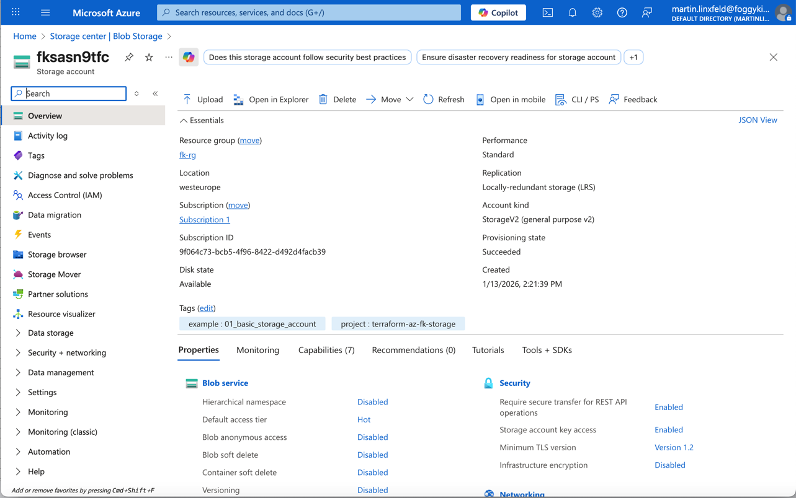

# Example 01: Azure Storage Account (Minimal Baseline)

In this first storage example, we deploy a **single Azure Storage Account**
using **Terraform / OpenTofu**.

This example introduces the **storage layer** and is intentionally kept minimal:
no blob containers, no file shares, no network rules, no private endpoints.

Its only purpose is to establish a **clean, correct baseline**
for all future Azure Storage use cases.

---

## 🧭 Architecture Overview

This deployment creates **only one core resource**:  
a single **Azure Storage Account (StorageV2)**.

No assumptions are made about workloads yet.
The Storage Account acts as a **foundational boundary**
for everything that will be added later:
Blob containers, File Shares, AKS storage, network security, and private access.



This example creates:
- One **Azure Storage Account (StorageV2)**
- HTTPS-only access
- Minimum TLS version enforced
- No blob containers
- No file shares
- No network rules
- No private endpoints

This is a **storage foundation**, not a production-ready configuration.

---

## 🎯 Why this example exists

Before introducing:
- Blob Containers,
- Azure File Shares (RWX),
- Network Rules,
- Private Endpoints,
- or AKS storage integrations,

it is critical to understand **what a Storage Account actually represents**.

A Storage Account is not just a container for data.
It is a **security, networking, and replication boundary**
that defines how all child storage services behave.

This example focuses on:
- Establishing a correct Storage Account baseline
- Making security-related defaults explicit
- Separating the storage foundation from higher-level features

Everything else builds on top of this.

---

## 🚀 Deployment Steps

From the `examples/01_basic_storage_account` directory:

```bash
tofu init
tofu plan
tofu apply
```

---

## 🖼️ Azure Portal View



*Figure 1. Azure Storage Account (StorageV2) deployed using Terraform/OpenTofu as a minimal baseline.*

---

## 🧹 Cleanup

```bash
tofu destroy
```

---

## 🪪 License

Licensed under the **Universal Permissive License (UPL), Version 1.0**.

