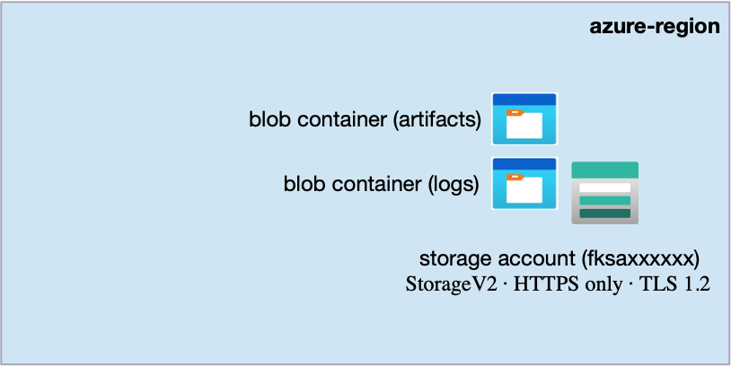
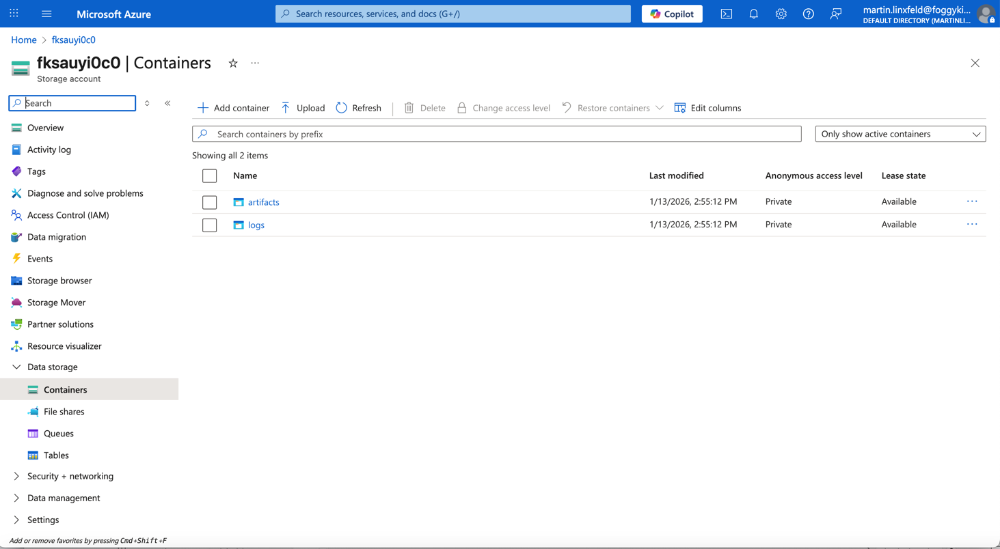

# Example 02: Blob Containers (Object Storage Foundation)

In this storage example, we extend the minimal baseline from **Example 01**
by creating **Blob Containers** inside a single **Azure Storage Account**
using **Terraform / OpenTofu**.

This example introduces **object storage structure**
while still remaining intentionally simple:
no file shares, no network rules, no private endpoints.

Its purpose is to show how **Blob Containers are used to organize data**
on top of a clean Storage Account baseline.

---

## 🧭 Architecture Overview

This deployment builds on the Storage Account created in Example 01
and adds multiple **Blob Containers**.

Each container represents a **logical boundary**
for a specific type of object data such as logs, artifacts, or assets.



This example creates:
- One **Azure Storage Account (StorageV2)**
- Multiple **Blob Containers**
- HTTPS-only access
- Minimum TLS version enforced
- No file shares
- No network rules
- No private endpoints

This is an **object storage foundation**, not a production-ready configuration.

---

## 🎯 Why this example exists

Before introducing:
- Azure File Shares (RWX),
- Storage access restrictions with Network Rules,
- Private Endpoints,
- or AKS storage integrations,

it is critical to understand **how Blob Storage is structured**.

Blob Containers are the **first layer of organization**
inside a Storage Account.
They define how object data is grouped, managed, and accessed.

This example focuses on:
- Creating Blob Containers declaratively using Terraform/OpenTofu
- Establishing clear container naming patterns
- Separating object storage structure from security hardening

Security and networking will be introduced in later examples.

---

## 🚀 Deployment Steps

From the `examples/02_blob_containers` directory:

```bash
tofu init
tofu plan
tofu apply
```

---

## 🖼️ Azure Portal View



*Figure 1. Blob Containers created inside an Azure Storage Account using Terraform/OpenTofu.*

---

## 🧹 Cleanup

```bash
tofu destroy
```

---

## 🪪 License

Licensed under the **Universal Permissive License (UPL), Version 1.0**.

