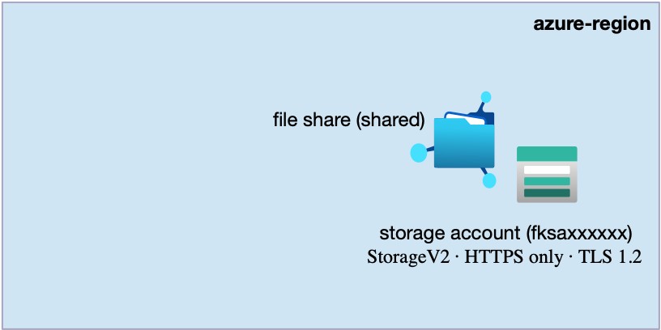
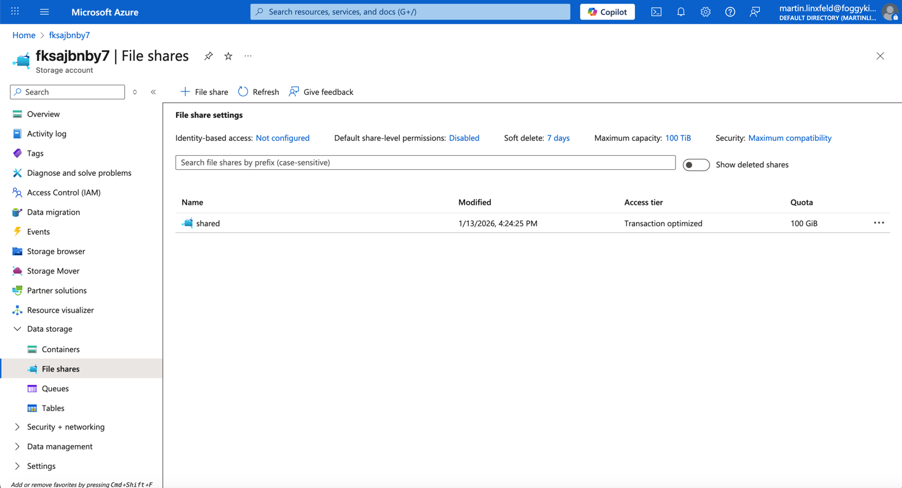

# Example 03: Azure File Share (RWX Storage Foundation)

In this storage example, we extend the previous object storage scenarios
by introducing **Azure File Shares** as a **shared filesystem (RWX)**,
using **Terraform / OpenTofu**.

This example focuses purely on the **storage capability**:
no compute resources, no Blob Containers, no network rules, no private endpoints.

Its purpose is to establish a **clean RWX storage baseline**
that can later be consumed by Virtual Machines or AKS clusters.

---

## 🧭 Architecture Overview

This deployment creates a single **Azure Storage Account**
with one **Azure File Share**.

The File Share represents a **ReadWriteMany (RWX)** storage layer,
allowing multiple compute instances or pods
to mount the same filesystem concurrently.



This example creates:
- One **Azure Storage Account (StorageV2)**
- One **Azure File Share**
- RWX (ReadWriteMany) semantics
- HTTPS-only access
- Minimum TLS version enforced
- No Blob Containers
- No network rules
- No private endpoints
- No compute resources

This is a **shared storage foundation**, not a production-ready configuration.

---

## 🎯 Why this example exists

Before introducing:
- Virtual Machines mounting shared storage,
- AKS Persistent Volumes with RWX access,
- Network Rules and Private Endpoints,
- or production security hardening,

it is critical to understand **what Azure File Share provides**.

Azure File Share is the primary RWX storage option in Azure.
It enables:
- shared application data,
- upload directories,
- logs shared across replicas,
- stateful workloads requiring concurrent access.

This example focuses on:
- Declaring File Shares using Infrastructure as Code
- Understanding RWX as a storage capability
- Keeping storage concerns separate from compute consumers

Compute integration is intentionally introduced in later examples.

---

## 🚀 Deployment Steps

From the `examples/03_file_share_rwx` directory:

```bash
tofu init
tofu plan
tofu apply
```

---

## 🖼️ Azure Portal View



*Figure 1. Azure File Share created inside an Azure Storage Account using Terraform/OpenTofu.*

---

## 🧹 Cleanup

```bash
tofu destroy
```

---

## 🪪 License

Licensed under the **Universal Permissive License (UPL), Version 1.0**.
