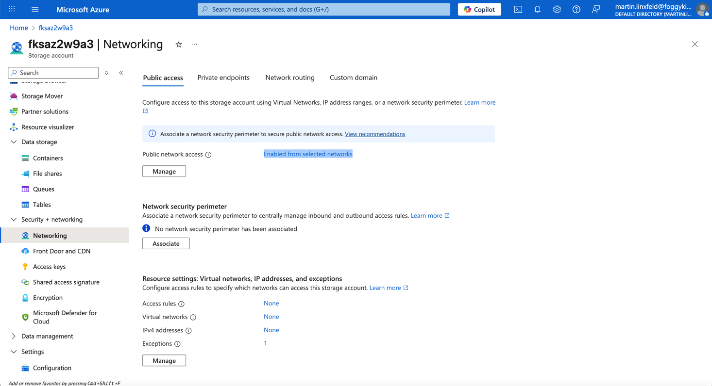

# Example 04: Storage Account Network Rules (Security Baseline)

In this storage example, we introduce **Network Rules** for an Azure Storage Account
to establish a **basic security boundary** using **Terraform / OpenTofu**.

This example focuses purely on **access control at the storage account level**:
no Blob Containers, no File Shares, no Private Endpoints, no compute resources.

Its purpose is to show how a Storage Account can remain **publicly reachable**
while access is **explicitly restricted** using network rules.

---

## 🧭 Architecture Overview

This deployment creates a single **Azure Storage Account**
with **Network Rules enforced**.

The public endpoint remains enabled,
but access is limited using an explicit allowlist
(IP addresses and/or virtual network subnets).


This example creates:
- One **Azure Storage Account (StorageV2)**
- Network Rules with `default_action = Deny`
- Explicit allow rules (IP / subnet)
- HTTPS-only access
- Minimum TLS version enforced
- No Blob Containers
- No File Shares
- No Private Endpoints
- No compute resources

This is a **security baseline**, not a complete production security model.

---

## 🎯 Why this example exists

Before introducing:
- Private Endpoints,
- Storage access from AKS or Virtual Machines,
- Advanced security controls,

it is critical to understand **how Storage Account Network Rules work**.

Network Rules provide a **first layer of protection**
by restricting which networks can reach the storage service,
even when a public endpoint exists.

This example focuses on:
- Enforcing `default_action = Deny`
- Allowlisting trusted sources explicitly
- Understanding the difference between *public endpoint* and *public access*

Private Endpoints are introduced in later examples.

---

## 🚀 Deployment Steps

From the `examples/04_network_rules` directory:

```bash
tofu init
tofu plan
tofu apply
```

---

## 🖼️ Azure Portal View



*Figure 1. Azure Storage Account with Network Rules applied using Terraform/OpenTofu.*

---

## 🧹 Cleanup

```bash
tofu destroy
```

---

## 🪪 License

Licensed under the **Universal Permissive License (UPL), Version 1.0**.
