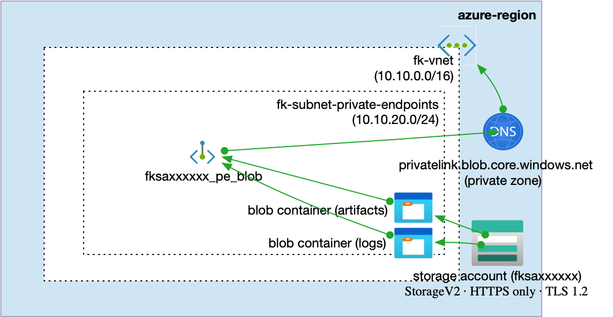

# Example 05: Blob Private Endpoint (Private Access + DNS)

In this storage example, we move from **restricted public access**
to **private connectivity** by introducing a **Private Endpoint for Azure Blob Storage**
using **Terraform / OpenTofu**.

This example focuses on **private network access and DNS resolution**
while still defining **data intent** through Blob Containers.

No compute resources are attached.

---

## 🧭 Architecture Overview

This deployment creates a single **Azure Storage Account**
exposed through a **Private Endpoint** for the Blob service,
with private name resolution handled by **Azure Private DNS**
via the `terraform-az-fk-private-dns` module.

Blob Containers are created to represent **intended data usage**
(e.g. artifacts and logs), even though no consumers are attached yet.



This example creates:
- One **Azure Storage Account (StorageV2)** via `terraform-az-fk-storage`
- Two **private Blob Containers** (e.g. `artifacts`, `logs`) via `terraform-az-fk-storage`
- One **Private Endpoint** for the **Blob** subresource via `terraform-az-fk-private-endpoint`
- One **Private DNS Zone** (`privatelink.blob.core.windows.net`) via `terraform-az-fk-private-dns`
- A **VNet link** for private DNS resolution via `terraform-az-fk-private-dns`
- HTTPS-only access
- Minimum TLS version enforced
- Network Rules with `default_action = Deny`
- No compute resources

This is a **private storage baseline**, not a complete production deployment.

---

## 🎯 Why this example exists

After understanding:
- public endpoints with restricted access (Example 04),
- network rules as a first security boundary,

the next logical step is to **introduce private connectivity**
and remove the public storage surface from the data path.

Private Endpoints provide:
- private IP-based access to PaaS services,
- traffic that never leaves the Azure backbone,
- native integration with Virtual Networks and DNS.

This example focuses on:
- Understanding how Blob Storage behaves when exposed privately
- Seeing the role of Private DNS Zones in name resolution
- Defining storage **before** workloads exist

Blob Containers are created to define **data intent**, not consumption.

Integration with compute services (VMs, AKS, CI/CD pipelines)
is introduced in later examples.

---

## 🔐 About Network Rules in this example

Network Rules are enabled to:
- keep the storage account locked down (`default_action = Deny`),
- allow Terraform provisioning from a trusted source,
- preserve a deterministic deployment experience without compute resources.

In fully private environments, data-plane provisioning
would typically run from within the Virtual Network
(e.g. via a private runner).

---

## 🚀 Deployment Steps

From the `examples/05_private_endpoint_blob` directory:

```bash
tofu init
tofu plan
tofu apply
```

---

## 🖼️ Azure Portal View


*Figure 1. Azure Blob Storage with private connectivity, Private DNS resolution,
and predefined Blob Containers.*

---

## 🧹 Cleanup

```bash
tofu destroy
```

---

## 🪪 License

Licensed under the **Universal Permissive License (UPL), Version 1.0**.
