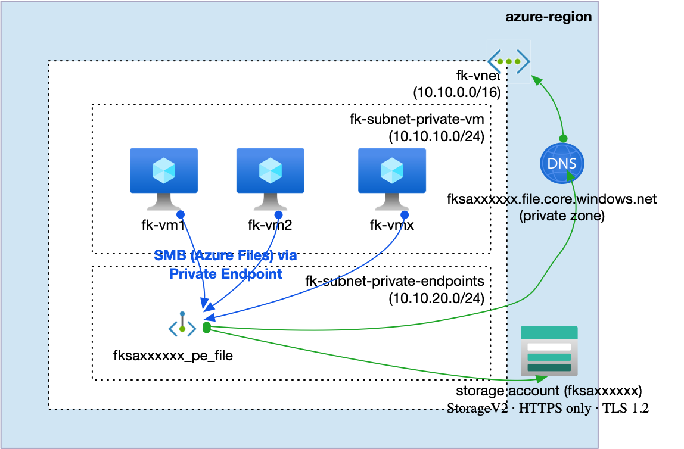
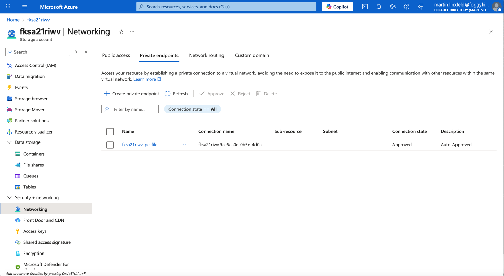
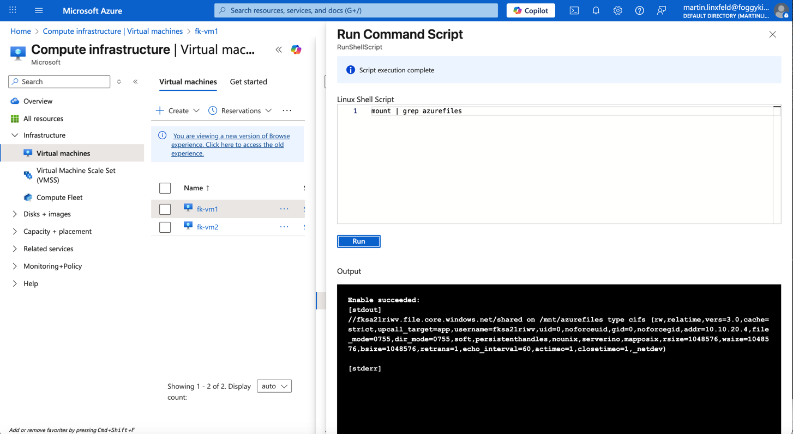

# Example 06: Azure Files Private Endpoint with Virtual Machines (RWX in Practice)

In this storage example, we combine **Azure Files (RWX storage)** with **Private Endpoints**
and **real compute consumers** to demonstrate **end-to-end private access**
using **Terraform / OpenTofu**.

This example moves beyond connectivity alone and shows **how shared storage is actually consumed**
by workloads inside a Virtual Network.

Two private Linux Virtual Machines mount the same **Azure File Share**
through a **Private Endpoint**, proving **ReadWriteMany (RWX)** semantics in practice.

---

## 🧭 Architecture Overview

This deployment creates a single **Azure Storage Account**
with an **Azure File Share** exposed via a **Private Endpoint**
and consumed by **two private Virtual Machines**,
with private name resolution handled by `terraform-az-fk-private-dns`.

The public endpoint exists only for controlled bootstrap access (Terraform),
while all workload traffic flows privately through the Azure backbone
and is resolved using **Private DNS**.



This example creates:
- One **Azure Storage Account (StorageV2)** via `terraform-az-fk-storage`
- One **Azure File Share (RWX)** via `terraform-az-fk-storage`
- One **Private Endpoint** for the **File** subresource via `terraform-az-fk-private-endpoint`
- One **Private DNS Zone** (`privatelink.file.core.windows.net`) via `terraform-az-fk-private-dns`
- A **VNet link** for private DNS resolution via `terraform-az-fk-private-dns`
- Two **private Linux Virtual Machines** via `terraform-az-fk-compute`
- Azure Files mounted via **SMB over Private Endpoint**
- HTTPS-only access
- Minimum TLS version enforced
- Public access restricted using **Network Rules**
- No bastion host
- No VPN

This is a **private workload integration baseline**, not a complete production architecture.

---

## 🎯 Why this example exists

After learning:
- how Azure Files provides **RWX storage** (Example 03),
- how network rules restrict public access (Example 04),
- how Private Endpoints enable private connectivity (Example 05),

the next critical step is understanding **how real workloads consume private storage**.

This example focuses on:
- Mounting Azure Files via **Private Endpoint**
- Understanding the role of **Private DNS** in name resolution
- Proving **shared filesystem semantics** across multiple VMs
- Seeing the difference between *storage connectivity* and *storage consumption*

Two Virtual Machines writing to the same mounted directory
provide a concrete, observable demonstration of RWX behavior.

AKS-based consumption of Azure Files is covered separately
in the AKS training module, where storage is provisioned via CSI drivers.

---

## 🚀 Deployment Steps

From the `examples/06_private_endpoint_file_with_vm` directory:

```bash
tofu init
tofu plan
tofu apply
```

After deployment, both Virtual Machines automatically mount
the shared Azure File Share using cloud-init.

Each VM writes a proof file:
```
/mnt/azurefiles/from-<hostname>.txt
```

confirming shared access.

---

## 🖼️ Azure Portal View



*Figure 1. Azure File Share mounted by multiple private Virtual Machines via a Private Endpoint.*

---

## 🔍 Verifying the Mount (Proof)



*Figure 2. Azure File Share successfully mounted on a private Virtual Machine via a Private Endpoint.*

The output confirms that:
- the Azure File Share is mounted using **SMB 3.0**,
- the mount uses the **`fksaxxxxxx.file.core.windows.net` endpoint**,
- access is resolved privately through the Virtual Network and Private DNS.
---

## 🧹 Cleanup

```bash
tofu destroy
```

---

## 🪪 License

Licensed under the **Universal Permissive License (UPL), Version 1.0**.
